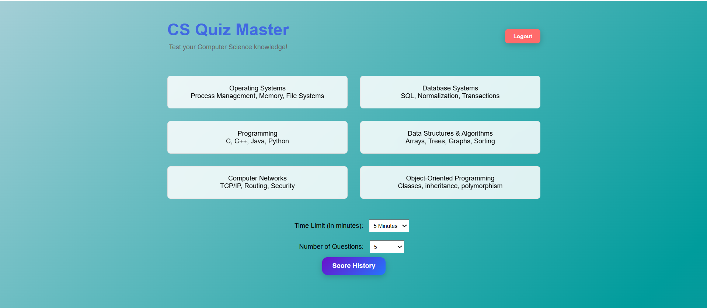
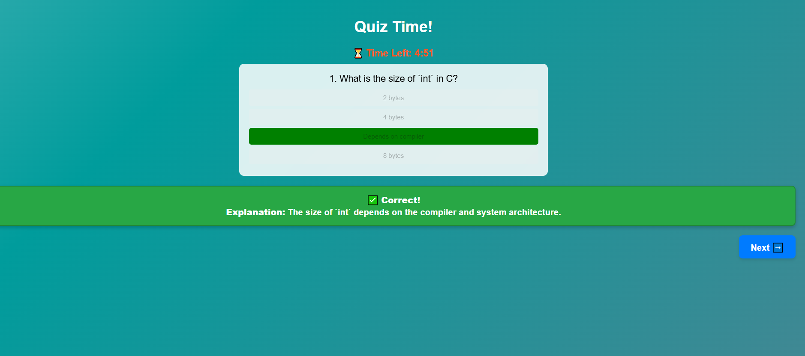
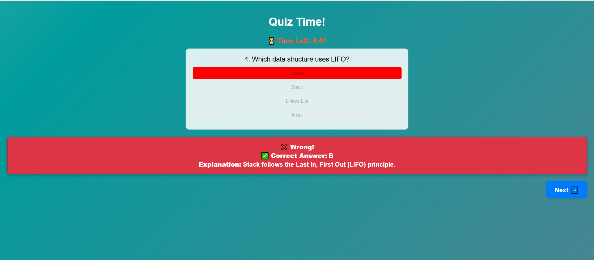
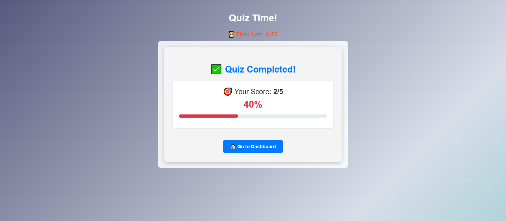
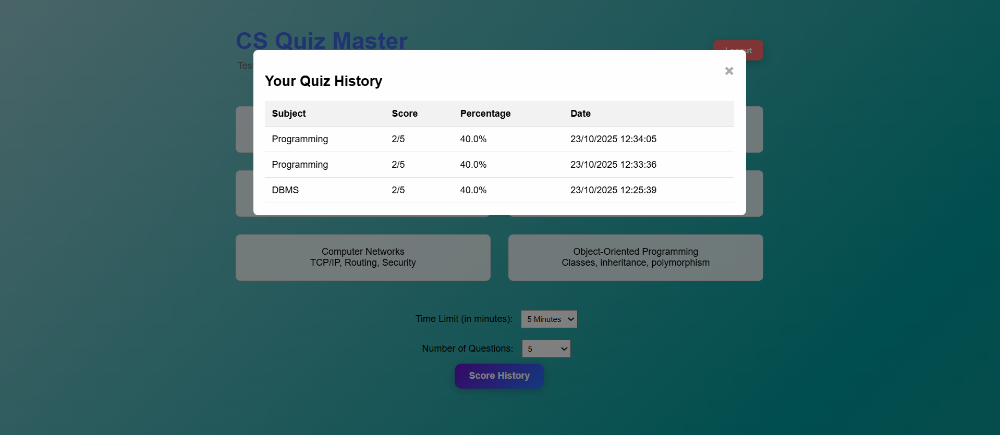

# 🧠 Quiz It

Une application web interactive permettant aux étudiants en informatique de tester leurs connaissances à travers des quiz chronométrés et notés automatiquement.

## 🚀 Fonctionnalités

- 🔐 **Authentification** - Inscription et connexion sécurisées avec JWT
- 🧾 **Quiz chronométrés** - Questions à choix multiples avec limite de temps
- 🧮 **Calcul automatique du score** - Évaluation instantanée des réponses
- 📊 **Résultats détaillés** - Affichage des bonnes et mauvaises réponses
- 🕓 **Historique des quiz** - Suivi des scores, dates et sujets passés
- 💾 **Base de données MySQL** - Stockage sécurisé des utilisateurs et quiz
- 🎨 **Interface responsive** - Design clair et adapté à tous les appareils

## 🛠️ Technologies utilisées

| Catégorie | Technologies |
|-----------|--------------|
| **Frontend** | HTML5, CSS3, JavaScript (Vanilla) |
| **Backend** | Node.js, Express.js |
| **Base de données** | MySQL |
| **Authentification** | JSON Web Tokens (JWT) |

## 📋 Prérequis

- Node.js (v14 ou supérieur)
- MySQL (v5.7 ou supérieur)
- Un navigateur web moderne
- Git

## ⚙️ Installation et exécution locale

### 1. Cloner le projet

\`\`\`bash
git clone https://github.com/votre-username/quiz-it.git
cd quiz-it
\`\`\`

### 2. Créer la base de données

\`\`\`bash
mysql -u root -p
\`\`\`

Puis exécutez :

\`\`\`sql
CREATE DATABASE quiz_system;
USE quiz_system;
\`\`\`

Importez le fichier de base de données :

\`\`\`bash
mysql -u root -p quiz_system < backend/database.sql
\`\`\`

### 3. Configurer les variables d'environnement

Dans le dossier `backend`, créez un fichier `.env` :

\`\`\`env
PORT=5000
DB_HOST=localhost
DB_USER=root
DB_PASS=votre_mot_de_passe
DB_NAME=quiz_system
JWT_SECRET=votre_secret_jwt_tres_securise
\`\`\`

### 4. Installer les dépendances backend

\`\`\`bash
cd backend
npm install
\`\`\`

### 5. Lancer le serveur

\`\`\`bash
npm start
\`\`\`

Le serveur démarre sur `http://localhost:5000`

### 6. Ouvrir le frontend

Ouvrez le fichier `frontend/index.html` dans votre navigateur ou utilisez l'extension **Live Server** de VS Code.

L'application est accessible sur `http://127.0.0.1:5501/frontend`

## 📸 Captures d'écran

### Connexion / Inscription

### Dashboard des sujets

### Quiz - Question correcte

### Quiz - Question incorrecte

### Résultats

### Historique des quiz

## 📁 Structure du projet

\`\`\`
quiz-it/
├── frontend/
│   ├── index.html              # Page de login/register
│   ├── dashboard.html          # Dashboard des sujets
│   ├── quiz.html               # Page du quiz
│   ├── results.html            # Page des résultats
│   ├── history.html            # Historique des quiz
│   ├── styles.css              # Styles globaux
│   ├── auth.js                 # Logique d'authentification
│   ├── dashboard.js            # Logique du dashboard
│   ├── quiz.js                 # Logique du quiz
│   └── history.js              # Logique de l'historique
├── backend/
│   ├── server.js               # Serveur Express
│   ├── database.sql            # Schéma de la base de données
│   ├── routes/
│   │   ├── auth.js             # Routes d'authentification
│   │   ├── quiz.js             # Routes des quiz
│   │   └── history.js          # Routes de l'historique
│   ├── middleware/
│   │   └── auth.js             # Middleware JWT
│   └── .env                    # Variables d'environnement
└── README.md                   # Ce fichier
\`\`\`

## 🔐 Sécurité

- Les mots de passe sont hashés avec bcrypt
- Les tokens JWT expirent après 24 heures
- Les requêtes sont validées côté serveur
- Les données sensibles sont stockées de manière sécurisée

## 🚀 Déploiement

### Déployer sur Vercel (Frontend)

\`\`\`bash
npm install -g vercel
vercel
\`\`\`

### Déployer sur Heroku (Backend)

\`\`\`bash
heroku create votre-app-name
git push heroku main
\`\`\`

## 🤝 Contribution

Les contributions sont les bienvenues ! Pour contribuer :

1. Forkez le projet
2. Créez une branche pour votre fonctionnalité (`git checkout -b feature/AmazingFeature`)
3. Committez vos changements (`git commit -m 'Add some AmazingFeature'`)
4. Poussez vers la branche (`git push origin feature/AmazingFeature`)
5. Ouvrez une Pull Request

## 📝 Licence

Ce projet est sous licence MIT. Voir le fichier `LICENSE` pour plus de détails.

## 👨‍💻 Auteur

**Votre Nom**
- GitHub: [@votre-username](https://github.com/votre-username)
- Email: votre.email@example.com

## 📞 Support

Si vous avez des questions ou des problèmes, veuillez ouvrir une issue sur GitHub.

---

**Fait avec ❤️ pour les étudiants en informatique**
